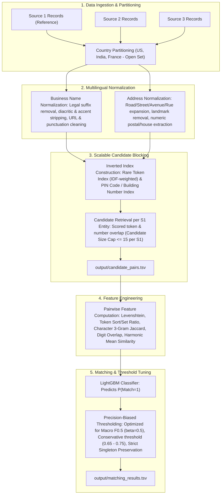

# Amazon ML Challenge 2026: Business Entity Resolution

[](https://www.python.org/downloads/)
[](https://opensource.org/licenses/MIT)
[](https://lightgbm.readthedocs.io/)
[](#-3-evaluation-metric--singleton-mechanics)

---

## 📌 1. Challenge Overview

In large-scale commercial platforms like Amazon, business identity records arrive from heterogeneous, independent sources. Each record contributes noisy, incomplete fragments without common foreign keys or unique global identifiers. Determining whether two multi-source records correspond to the same real-world enterprise is the classic **Entity Resolution (ER)** challenge.

### Objective
- **Source 1 (`S1-`):** The deduplicated reference source.
- **Source 2 (`S2-`) & Source 3 (`S3-`):** Noisy secondary sources.
- **Goal:** For every Source 1 entity, identify all matching records from Source 2 and Source 3 (cardinality: 0, 1, or many).
- **Scale:** ~2.2M Source 1 records in train, ~1.73M Source 1 in test, and over **10 million** candidate records in Source 2 and 3.

---

## 🏗️ 2. End-to-End Pipeline Architecture



---

## 📊 3. Evaluation Metric & Singleton Mechanics

Submissions are evaluated using the **Macro-Averaged F_beta Score (beta = 0.5)**, placing twice as much emphasis on **Precision** over Recall:

$$F_{0.5} = \frac{1.25 \times \text{Precision} \times \text{Recall}}{0.25 \times \text{Precision} + \text{Recall}}$$

### Key Metric Rules:
1. **Macro-Average over All Source 1 Entities**: F_0.5 is calculated per Source 1 entity and averaged across the entire evaluation set.
2. **Singletons Count**: Source 1 entities with no true matches (singletons) score:
   - **1.0** if the predicted match list is correctly left empty (`""`).
   - **0.0** if any false positive candidate is predicted (false merge penalty).
3. **Candidate Set Compactness**: The competition explicitly evaluates `candidate_pairs.tsv`. Pipelines generating a **smaller, high-quality candidate set per Source 1 entity** are prioritized and ranked higher beyond leaderboard scores.

---

## 📁 4. Project Workspace Organization

```
d:\AmazonMLChallenge\
├── student_resource\                     # Original competition archive
│   ├── dataset\
│   │   ├── train\                        # train_source1, train_source2, train_source3, train_ground_truth
│   │   └── test\                         # test_source1, test_source2, test_source3
│   ├── utils\
│   │   └── validate_submission.py        # Official submission format validator
│   ├── Documentation_template.md         # Official methodology template
│   └── README.md
├── code\
│   └── business_entity_resolution\      # Standalone submission code bundle
│       ├── src\
│       │   ├── __init__.py
│       │   ├── config.py                # Hyperparameters, thresholds & file paths
│       │   ├── data_loader.py           # Chunked TSV streaming loaders
│       │   ├── preprocessor.py          # Multilingual text cleaners & regex suffix engines
│       │   ├── blocking.py              # Inverted index blocking with candidate size caps
│       │   ├── features.py              # Pairwise fuzzy string & numeric similarity features
│       │   ├── model.py                 # LightGBM classifier with F0.5 calibration
│       │   ├── evaluate.py              # Exact macro F0.5 evaluator with singleton logic
│       │   ├── pipeline.py              # Full end-to-end execution script
│       │   └── utils.py                 # TSV writer, timing & logger
│       ├── README.md                    # Reproduction documentation
│       └── requirements.txt             # Pinned pip dependencies
├── data\
│   ├── samples\                         # Lightweight splits for sub-second development
│   └── processed\                       # Intermediate indices & feature tables
├── models\                              # Saved GBDT weights and checkpoints
├── notebooks\                           # EDA and benchmarking notebooks
├── output\                              # Final generated artifacts
│   ├── candidate_pairs.tsv              # Blocking output fed to classifier
│   └── matching_results.tsv             # Final predictions scored on leaderboard
├── scripts\                             # Workflow automation utilities
│   ├── create_sample_split.py           # Generates 10k-entity development mini-splits
│   ├── evaluate_local.py                # Local validation scoring script
│   └── package_submission.py            # Bundles <team_name>_submission.zip
├── Documentation_template.md            # Filled methodology write-up
├── .gitignore                           # Airtight exclusions (no datasets/models to Git)
└── README.md                            # Comprehensive project guide (this file)
```

---

## 🛠️ 5. Step-by-Step Reproduction Guide

### Step 1: Environment Setup
Ensure Python 3.8+ is installed:
```bash
pip install -r code/business_entity_resolution/requirements.txt
```

Core dependencies:
- `rapidfuzz>=3.5.0` (high-performance C++ string matching)
- `lightgbm>=4.0.0` (gradient boosted decision trees)
- `scikit-learn>=1.3.0`
- `pandas>=2.0.0`
- `scipy>=1.11.0`
- `tqdm>=4.66.0`

### Step 2: Rapid Development Sample Split
To experiment, tune thresholds, and benchmark features in seconds rather than waiting for 10M rows:
```bash
python scripts/create_sample_split.py
```
This extracts a verified 10,000-entity split with true matches and distractors into `data/samples/`.

### Step 3: Run Full Pipeline
To execute end-to-end blocking, feature extraction, and prediction on the dataset:
```bash
python -m code.business_entity_resolution.src.pipeline
```
Outputs produced:
- `output/candidate_pairs.tsv`: Final candidate set evaluated for blocking quality.
- `output/matching_results.tsv`: Final entity matches scored on the leaderboard.

### Step 4: Local Evaluation
Evaluate local predictions against ground truth with detailed macro F_0.5 and singleton diagnostics:
```bash
python scripts/evaluate_local.py \
    --pred output/test_sample_matching.tsv \
    --cand output/test_sample_candidate.tsv \
    --gt data/samples/sample_ground_truth.tsv
```

### Step 5: Official Validation & Submission Packaging
Validate generated files against every rule enforced by the challenge scorer and build the final zip archive:
```bash
python scripts/package_submission.py --team-name <your_team_name>
```

This generates `<team_name>_submission.zip` matching the exact required archive structure:
```
<team_name>_submission.zip
├── output/
│   ├── matching_results.tsv
│   └── candidate_pairs.tsv
├── code/
│   └── business_entity_resolution/
│       ├── src/
│       ├── README.md
│       └── requirements.txt
└── Documentation_template.md
```

---

## ⚙️ 6. Core Methodology & Techniques

### Multilingual Normalization
1. **Legal Suffixes**: Strips common corporate designations across:
   - **US/UK**: `Inc`, `LLC`, `Corp`, `Corporation`, `Holdings`, `Company`, `Co`, `LLP`.
   - **India**: `Pvt Ltd`, `Private Limited`, `LLP`, `Proprietorship`.
   - **France**: `SARL`, `SAS`, `SASU`, `SCI`, `EURL`, `Cie`.
   - **Devanagari Transliteration**: `प्राइवेट लिमिटेड`, `प्रा. लि.`, `लिमिटेड`, `एलएलपी`.
2. **Diacritics & Accents**: Standardizes French characters (`é`, `è`, `ê`, `à`, `ç`) to basic Latin via Unicode NFD decomposition.
3. **Address Term Standardization**: Canonicalizes road abbreviations (`st` -> `street`, `rd` -> `road`, `ave` -> `avenue`, `r.` -> `rue`).
4. **Number Extraction**: Extracts digit tokens (PIN codes, ZIP codes, building/plot numbers) for high-precision spatial anchors.

### Scalable Inverted Index Blocking
- **Country Partitioning**: Hard constraint ensuring records are matched only within the same country partition (US <-> US, India <-> India, France <-> France).
- **Inverted Token Indexing**: Rare, informative name tokens index candidate IDs with inverse document frequency (IDF) downweighting for generic stop words (`solutions`, `store`, `clinic`, etc.).
- **Candidate Trimming**: Scored candidate sets are strictly capped at <= 15 candidates per Source 1 entity, directly addressing the competition's candidate size evaluation criteria.

### Feature Engineering & Re-Ranking
- **Lexical Similarities**: Token Sort Ratio, Token Set Ratio, Levenshtein Ratio, and Partial Ratio computed via `rapidfuzz`.
- **Character N-Gram Jaccard**: 3-gram character intersection to capture phonetic and typo variations.
- **Numerical Alignment**: Exact match of building and postal code digits.
- **Cross-Field Harmonic Mean**: Non-linear composite score balancing name and address agreement.
- **Threshold Calibration**: Precision-favored probability threshold (tau approx 0.65 - 0.75) to protect singleton score integrity and optimize F_0.5.

---

## ⚖️ 7. Fair Play & Competition Compliance

- **No External Data Lookup**: The pipeline relies purely on provided training datasets. No commercial APIs, geocoding engines, or external registries are queried.
- **Open-Set Country Labeling**: Country is dynamically partitioned; France (unseen in training) is fully supported during test inference.
- **Model Size & License**: All models utilize permissive MIT/Apache 2.0 architectures well within the 8 Billion parameter constraint.
